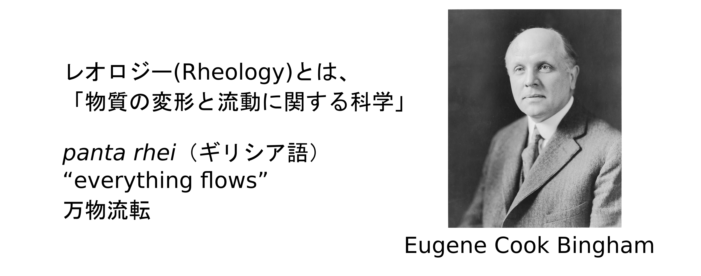
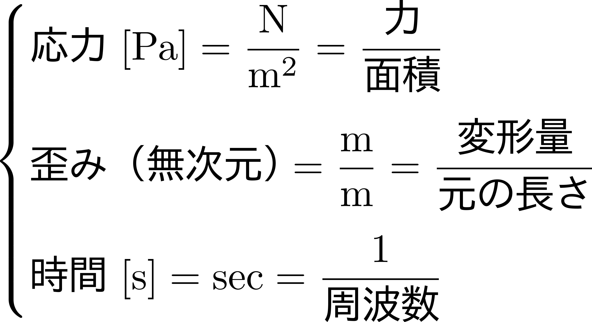
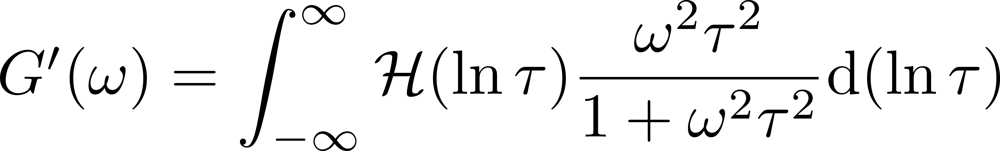
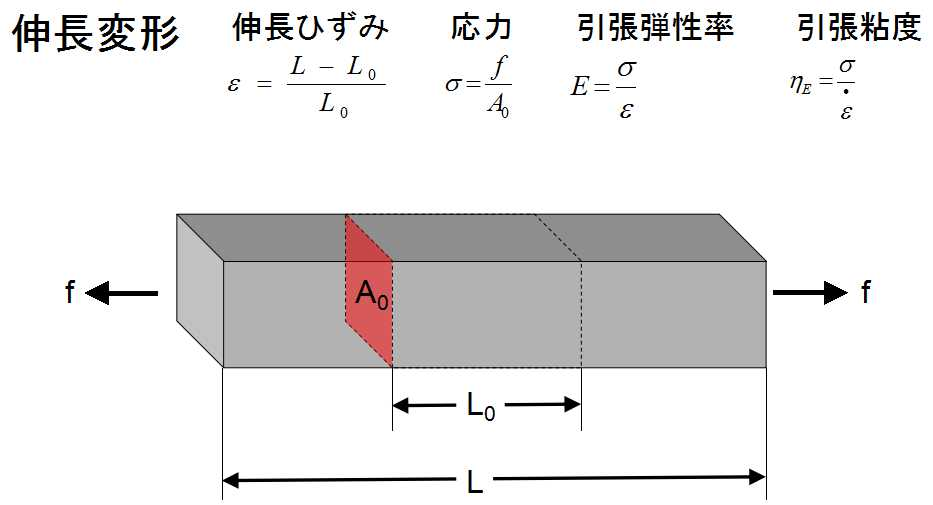

<!-- theme: gaia -->

<!-- page_number: true -->
<!-- paginate: true -->

<!-- _class: lead -->

# 数式に頼らない 「レオロジー超入門講座」

## 東亞合成（株）
## 佐々木裕

---

# 1_はじめに

- 簡単な自己紹介
- レオロジーとは
- 難しい点
- 理解へのアプローチ
- 本講座の進め方

---

## 簡単な自己紹介

- 自己紹介
	- 佐々木裕
	- 東亞合成（株）　1986～現在
- 研究・開発歴
	- 各種の光硬化型材料
	- 機能性材料の特性評価
	- シミュレーションやレオロジー
- モットー
	- 化学をベースに、尤もらしく。  
	- 物理、数学、統計の考えを利用して。

---

## レオロジーとは

---

### レオロジーとは

1929年にアメリカにおいてレオロジー学会  
「 The Society of Rheology (SOR) 」が設立された。

aaaa

---

### 相対的な比較（異種格闘技？）

- 水と蜂蜜の力学的性質を比べるとずいぶん違う
	- 蜂蜜
		- 容易にかき回すことができない。
		- 流れにくい。
	- 水
		- たやすくコップに注ぎ込むことができる。
- このちがいを何であらわすか？
- 例えば、ハチミツとマヨネーズでは？  

---

### レオロジーとは

- 現象論的には、以下の三つの関係を調べ、 物質の特性を評価する科学。

---

## 難しい点

---

### 両極端な議論

- あまりにもイメージに偏った議論
	- この時はこう、あの時はああ。
	- それなら。今はどの時？
- 分かり難い言葉と数式の羅列で数学的なお話
	- 例えば、一般化マックスウェルモデルの動的貯蔵弾性率を表す数式

---

### 油断するとよくわからない （逃げ言葉？）

- 「応力集中が粘弾性により緩和します。」
- 「非ニュートン流体の特徴的な流動を設計しなければいけない。」
- 「チクソ性の高い液体は液だれしにくい。」
- 「のど越しのいいビールは筋電図の低周波成分を抑制できるものである。」

分かったような、でもなんだかよく考えると、 ヤッパリ良く判らない言葉。

---

### 混乱しやすいもう一つの原因

- レオロジーの対象は非常に幅広い
	- 人間の心地よさをレオロジー的感覚で評価
		- 「ナタデココ」
		- 肌触りのよい下着
	- 機能設計にレオロジーを利用
		- ショックのない運動靴
		- 塗り易くて液だれしない塗料

微妙に使っている言葉が異なり混乱しやすい。

---

### よくある状態

- ありがちな両極端
	- 脳筋  
	とにかく測れ
	- 頭でっかち  
	理屈ばかりで手が動かない
- 誰もが、最初は素人
	- うまくやっている人の物まねが手っ取り早い
	- でも、近くにいい先輩がいないときは？
	- 新しい問題へのアプローチは？
---

## 理解へのアプローチ

---

### ヤッパリ分かりにくい

- レオロジー技術
	- 非常に多様な切り口での議論
		- 食品、塗料、心地よさ、潤滑油、等々
	- それぞれの要素技術が異なる⇔内容が多岐
	- 一見複雑に見える。
- そのため、この分野に興味を持たれた初心者の方たちの中には、習得するのが大変そうだなと思われている方も多いのかもしれない。

---

# 急がば回れ

---

### イメージで捉えてみては

- イメージとして全体像をザックリと捕まえることができれば、理解は一気に容易になる。
- 「レオロジー」を、工学的に簡単に言えば、  
	- 「物質」に、
	- 「刺激（変形、応力）を与えると」、
	- 「どうなるか（流れる、応力を発生）？」
- 大事なポイント：時間のことも考慮に入れる。

---

### 「見える化」

- 「何をやりたいのか？」を常に意識しながら、
	- 因果関係をはっきりと  
		- 因←原因  
		- 果←結果
	- 図として捉える
		- 複雑な実事象をできるだけ単純化
		- 一目で理解できるように  

---

### 色々なモデル化

例えば、東洋思想においての考え方

- 単純化
	- 陰陽思想⇔二分化
	- 五行思想⇔分類
- 組み合わせ
	- 陰陽五行
	- 八卦

ギリシア思想でも似たようなもの

---

### モデル化の適正な度合い

- 適度な深さで尤もらしく
	- 簡単すぎるものは例外が多い。
	- 複雑化しすぎても過適応
		- n個のデータを、n次の関数でフィット   
		- 個々の現象にだけ適応可能
		- モデル化する意味がない
- 欲しいもの
	- 汎用的に使えるモデル
	- 尤もらしく、実験事実を説明できるもの

---

## 本講座の進め方

  あああ

---

### 本講座の進め方

以下のような点に気を付けて進めます。

- イメージしやすい、直感的な理解を目指す。
	- 全体を俯瞰した概念的な説明
	- 多様な切り口からの説明  
- 大事なことは何度か繰り返す。
	- 一度ではわかりにくいかも。
	- 似たような内容を、ちょっと違う言葉で。
- ゆっくり議論
	- 理解し難いことはいつでも聞いて下さい。
---

### 「数式に頼らない」という意味

- 「天下りの数式展開」は無駄。
	- 意味の理解できない数式は無意味
	- たいてい、思考停止を招くだけ。
- でも、状態をイメージするためには、数学的な感覚は有効
	- 数学（算数？）的な事項の復習も。
	- 物理的なイメージを数学とつなげて理解
- 私に分かり易い表現があなたに有効とは限らないので数式の表すものを議論しましょう。
	- 理解し難いことはいつでも聞いて下さい。

---

## 参考書

- レオロジー関連
	- [レオロジー基礎論：村上鎌吉](https://www.amazon.co.jp/%E3%83%AC%E3%82%AA%E3%83%AD%E3%82%B8%E3%83%BC%E5%9F%BA%E7%A4%8E%E8%AB%96-%E6%9D%91%E4%B8%8A-%E8%AC%99%E5%90%89/dp/4782825315)
	- [おもしろレオロジー：増渕雄一](https://www.amazon.co.jp/%E3%81%8A%E3%82%82%E3%81%97%E3%82%8D%E3%83%AC%E3%82%AA%E3%83%AD%E3%82%B8%E3%83%BC-%E2%80%95%E3%81%A9%E3%82%8D%E3%81%A9%E3%82%8D%E3%80%81%E3%81%90%E3%81%AB%E3%82%83%E3%81%90%E3%81%AB%E3%82%83%E7%89%A9%E8%B3%AA%E3%81%AE%E7%A7%91%E5%AD%A6-%E7%9F%A5%E3%82%8A%E3%81%9F%E3%81%84-%E3%82%B5%E3%82%A4%E3%82%A8%E3%83%B3%E3%82%B9-%E5%A2%97%E6%B8%95/dp/4774143103/ref=sr_1_fkmrnull_1?__mk_ja_JP=%E3%82%AB%E3%82%BF%E3%82%AB%E3%83%8A&crid=3NKUKEKY9NBUV&keywords=%E3%81%8A%E3%82%82%E3%81%97%E3%82%8D%E3%83%AC%E3%82%AA%E3%83%AD%E3%82%B8%E3%83%BC&qid=1557628414&s=gateway&sprefix=%E3%81%8A%E3%82%82%E3%81%97%E3%82%8D%E3%82%8C%E3%81%8A%2Cstripbooks%2C250&sr=8-1-fkmrnull)
	- [レオロジーの世界：尾崎邦弘](https://www.amazon.co.jp/%E3%83%AC%E3%82%AA%E3%83%AD%E3%82%B8%E3%83%BC%E3%81%AE%E4%B8%96%E7%95%8C%E2%80%95%E5%9F%BA%E6%9C%AC%E6%A6%82%E5%BF%B5%E3%81%8B%E3%82%89%E7%89%B9%E6%80%A7%E3%83%BB%E6%A7%8B%E9%80%A0%E3%83%BB%E8%A6%B3%E6%B8%AC%E6%B3%95%E3%81%BE%E3%81%A7-%E5%B0%BE%E5%B4%8E-%E9%82%A6%E5%AE%8F/dp/4769341814/ref=pd_sbs_14_3/355-3703731-4533608?_encoding=UTF8&pd_rd_i=4769341814&pd_rd_r=58a50bf2-745e-11e9-8b82-99118fb491a2&pd_rd_w=9I9I8&pd_rd_wg=Z5H9Q&pf_rd_p=ad2ea29d-ea11-483c-9db2-6b5875bb9b73&pf_rd_r=DKRCWCM52WW6JDE1YE82&psc=1&refRID=DKRCWCM52WW6JDE1YE82)
	- 新講座・レオロジー：日本レオロジー学会
- その他
	- オイラーの贈物：吉田武

---

### スライド画面表示だけに頼らない理由

- 一枚の画像の中の情報の重要性は分かり難い
	- [「7人の命を奪ったPowerPointのスライド発表」とは？ - GIGAZINE ](https://gigazine.net/news/20190506-powerpoint-slide-killed-seven-people/)
	- 一枚ごとの情報を少なく。
- イメージをはっきり持つためには、ただ聞いているのではなく議論に参加。
	- [なぜフェルミ国立加速器研究所はPowerPointを禁止し黒板を使用するのか？ - GIGAZINE](https://gigazine.net/news/20140413-switch-to-whiteboard/)
- 理解し難いことはいつでも聞いて下さい。

---

aaa

試験用に作成中

Column 1 Contentここに書けばいいのだ。

Column 2 Content

Column 1 Contentここに書けばいいのだ。

vvv

---

<!-- # Bullet list

- One
	- i
	- j
		- llll
- Two
- Three -->

# Fragmented list

- One
	- sss
	- fff
		- hhh
- Two
	- a
	- b
- Three
---
<!-- _backgroundColor: aqua -->

Add underscore prefix `_` to the name of local directives.

# ppp

## GGG
---

The second page would not apply setting of directives.

# Ordered list

1. One
2. Two
3. Three

---

# Fragmented list

1) One
2) Two
3) Three