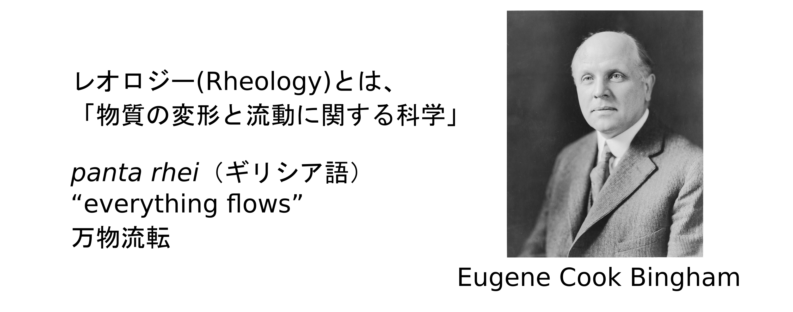
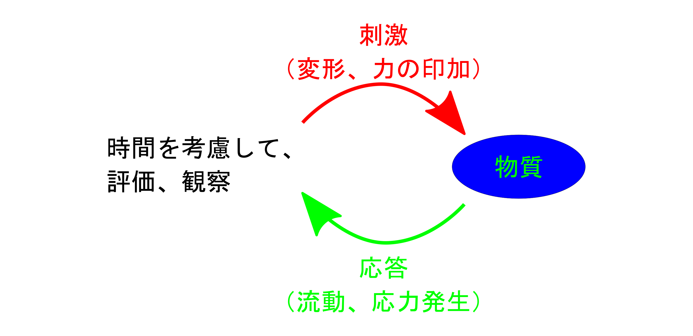
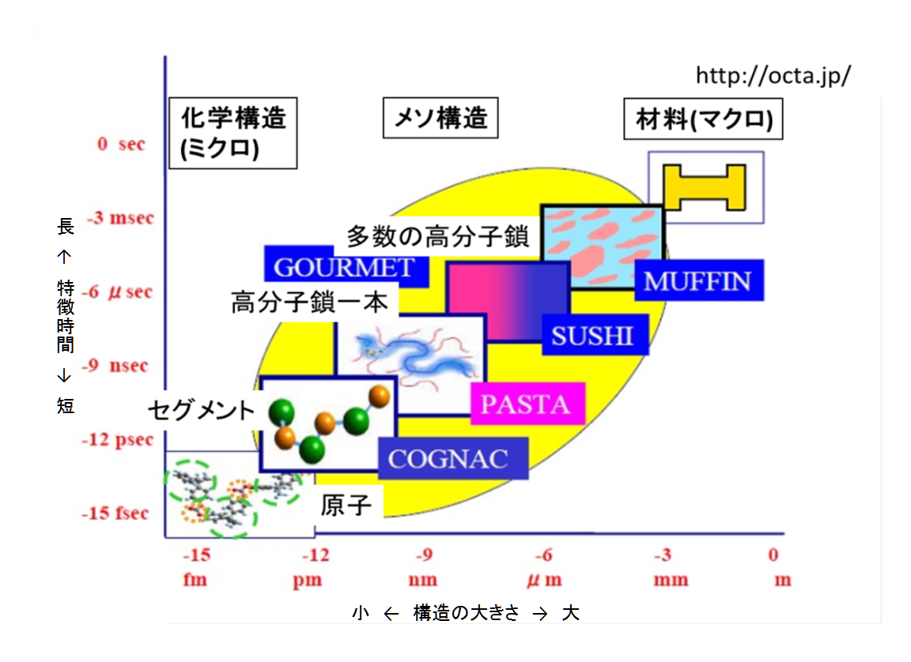
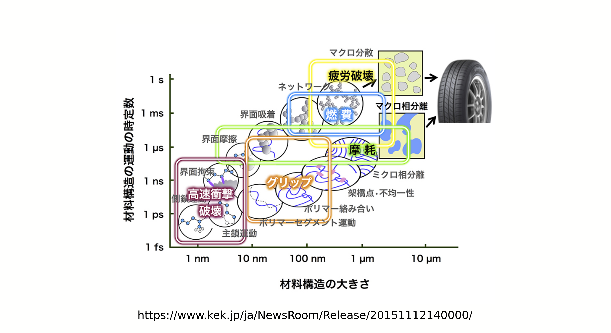

<!-- theme: gaia -->
<!-- page_number: true -->
<!-- paginate: true -->

# 2. 会社の仕事とレオロジー

- レオロジーとは
- 会社の仕事とレオロジー
- レオロジーと商品
- レオロジーとスケール

---

## レオロジーとは

---

### レオロジーの始まり

- 1929年にアメリカでレオロジー学会が設立
- 日本では、1951 年に第１回レオロジー討論会

---

### レオロジーが関連する分野

- 第６７回レオロジー討論会
	- 協賛：  日本材料学会，プラスチック成形加工学会，高分子学会，日本化学会，日本物理学会，繊維学会，応用物理学会，化学工学会，強化プラスチック協会，日本ゴム協会，日本接着学会，日本セラミックス協会，日本木材学会，セルロース学会，日本機械学会，日本雪氷学会，日本混相流学会，日本流体力学会，可視化情報学会，日本食品科学工学会，日本家政学会，日本調理科学会，日本食品工学会，日本繊維機械学会

---

### レオロジーが関連する分野

- 学術分野：化学、物理、生物、化学工学、応用物理、流体力学、地球物理学
- 高分子化学（科学）：プラスチック、繊維、ゴム、強化プラスチック
- 材料：金属、セラミックス、木材
- 応用：機械、接着、塗料、食品化学、調理科学、家政学、成型加工

---

### 非常に幅広い分野が関連

- レオロジーとは、高度に学際的な科学
- レオロジー技術
	- 非常に多様な切り口での議論
		- 食品、塗料、心地よさ、潤滑油、等々
	- それぞれの要素技術が異なる⇔内容が多岐
	- 一見複雑に見える。

---

## 会社の仕事とレオロジー

---

### 会社は営利団体で商品を作りたい

- 会社での仕事
	- 営利団体（利益を出し続けて、存続）
	- 利益を生み出せる商品（製品）を作りたい
- 開発のフロー
	- 原料⇒材料⇒商品
	- それぞれのステップで評価・解析に基づく、設計を行う。
- そのステップでレオロジーも活用。

---

### レオロジーの活用

<!--  -->
aaa

<!-- 
aaaaaaaaaaaaaaaaaaaaaaaaaaaaaaaaaaaaaaaaaaaaaaaaaaaaaaaaaaaaaaaaaaaaaaaaaaaaaaaaaaaaaaaaaaaaaaaaaaaaaaaaa
 -->

---

### 「評価・観察」とレオロジー

aaa

	

例えば、商品に必要な特性をレオロジーで評価

---

## レオロジーと商品 

---

### レオロジーと商品

- レオロジーを活用して商品を生み出す。
	- 人間の心地よさをレオロジー的感覚で評価
	- 機能設計にレオロジーを利用
---

### レオロジーと商品 （人間の心地よさを定量化）

- 人間の心地よさをレオロジー的感覚で評価
	- 「ナタデココ」
	- 「トッテモピーチ」（桃の繊維の舌触り）
	- 心地よいマッサージ装置
	- 肌触りのよい下着
	- 伸びの良い下地化粧品

---

### レオロジーと商品  （原料、材料の機能設計）

- 機能設計にレオロジーを利用
	- ショックのない運動靴（α-ゲル等）
	- 塗り易くて液だれしない塗料
	- ゴワゴワしない着やすい防弾チョッキ
	- よく飛ばせるゴルフクラブ
	- 耐震設計、免震設計

---

## このセクションのまとめ

- レオロジー技術は非常に多様な切り口での議論
	- 食品、塗料、心地よさ、潤滑油、等々
	- それぞれの要素技術が異なる⇔内容が多岐
- 実際の商品設計にも多用されている。
	- レオロジーは商品（企業の最終目的）の機能を解析し組み立てるための設計道具である。
	- 無くても商品はできるが、あれば便利。
- 大きく分けて、
	- 人の感覚を定量化
	- 原料、材料の機能設計

---

## レオロジーとスケール

---

### マクロとミクロとメゾスケール

- 我々が手で触れるマクロ⇔分子レベルはミクロ
- 中間には、メゾスケール

---

### 材料設計には各種スケールが

- たいていの場合、最終機能はマクロスケール
	- メゾスケールの多様な構造が機能と関連
	- 設計のためには、内部構造の理解も必要

---

## このセクションのまとめ

- 人間が容易に理解できるのはマクロスケールの事象。
	- 人が使う機能の設計もマクロで考えるべき。
- 材料の内部では、ミクロからマクロに至るメゾスケールが存在。
	- 機能の発現のためにはこのスケールが重要。
- 材料の機能を設計するためにはメゾスケールの理解が必要
	- 「分子レオロジー」