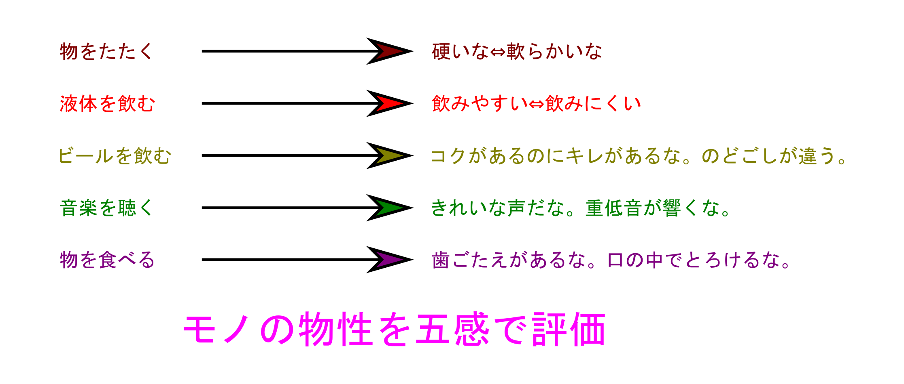
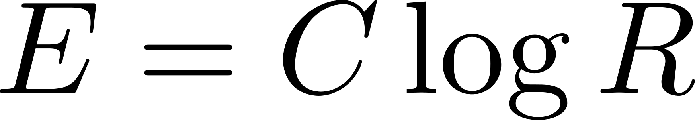

## 3. 人の感覚とレオロジー

* 人はみなレオロジスト
* 設計するためには定量化
* 桁数の違いで感じる

---

## 人はみなレオロジスト

--

###	人はみなレオロジスト

評価したい物質、材料を叩いて、その音で判断

* 陶磁器の品質を見分ける
	* 指先ではじいてその音を聞く
	* これは焼き上がり具合に応じて、粘弾性的な性質が変わり、振動状態が変化
* スイカの熟し具合
	* 外からたたいて判断
* 医者が打診によって診断

--

### レオロジーと商品 

* 人間の心地よさをレオロジー的感覚で評価
	* 「ナタデココ」
	* 「トッテモピーチ」（桃の繊維の舌触り）
	* 心地よいマッサージ装置
	* 肌触りのよい下着
	* 伸びの良い下地化粧品

--

### テクスチャーとオノマトペ

* 食品分野でのテクスチャー
	* もともとは、織物などの質感を意味する言葉
	* 食品の食感を決める重要な要素の一つ
* テクスチャーを表現する言語としてオノマトペ
	* 日本語はオノマトペが多彩かつ語数が多い
	* 食感に関する言葉はとくに多い
* レオロジーに関連する言葉
	* サラサラは低粘度、ドロドロは高粘度
	* ふにゃふにゃは低弾性、カチカチは高弾性

---

## 設計するためには定量化

--

###	設計するためには定量化

	

でも、設計するためには定量化する必要が！！

---

### 桁数の違いで感じる

--

### ウェーバー比

* 刺激（例えば重さ）を見積もる際に、
	* 増加の絶対量ではなく、
	* 何倍になったかという比で認識。

	

* 100の刺激が200になったとき「増加」と気付く場合を考えると、
	* 500の刺激が600に増加しても気付かず、
	* 気付かせるためには、少なくとも1000以上にする必要がある。

--

### [ウェーバー・フェヒナーの法則](https://ja.wikipedia.org/wiki/%E3%83%B4%E3%82%A7%E3%83%BC%E3%83%90%E3%83%BC%E2%80%90%E3%83%95%E3%82%A7%E3%83%92%E3%83%8A%E3%83%BC%E3%81%AE%E6%B3%95%E5%89%87)

* 弟子のフェヒナーがウェーバー比を微分方程式の形で解いて、

* 「心理的感覚は刺激強さの対数に比例。」
* この意味は、以下の二つが等しい。
	* 10の刺激が倍加して100になるときの感覚
	* 100の刺激が200ではなく1000になるとき
	
* 言い換えると、「強い刺激の変化には鈍感」

--

### （おまけ）星の等級

* 星の等級：天体の明るさを表す尺度
	* 整数または小数を用いて「1.2等」と表す。
	* 等級の値が小さいほど明るい天体
	* 0等級よりも明るい天体は負の数
* 等級が1等級変わると明るさは100の5乗根倍
	* 等級差が5等級の場合に明るさの差が100倍
	* 等級とは天体の明るさを対数スケールで表現

--

### 桁数の違いで感じる

* ウェーバー・フェヒナーの法則
	* 基準値によって閾値が変わるので、
		* 相対変化は見やすいが、絶対的な差はわかりにくい。
		* 元々強い刺激の変化には鈍感
		* 基準値をそろえたほうがわかりやすい。
* 桁数の違いで感じるということが大事。
--

### よく言われる（けど、分かりにくい）表現

* レオロジーで何がわかるのか？
	* 隠し味の調味料がわかるわけではない！
	* 調味料を加えた時に、味がどう変化したのかがわかる。
* 比較試料を用いて、相対値評価をする
	* 絶対値評価はできない。

対数的な応答と考えれば、理解しやすい。

---

## このセクションのまとめ

* サイコレオロジーという考え方は、人の感覚を定量化するためにとても有用。
	* ウェーバー・フェヒナーの法則
		* 人の感覚は、対数的な応答
		* 相対評価が主となる場合が多い。
		* 基準をよく考える。
* 桁数の違いで感じるということが大事。
