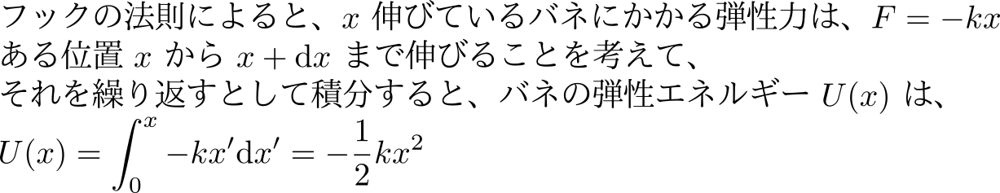
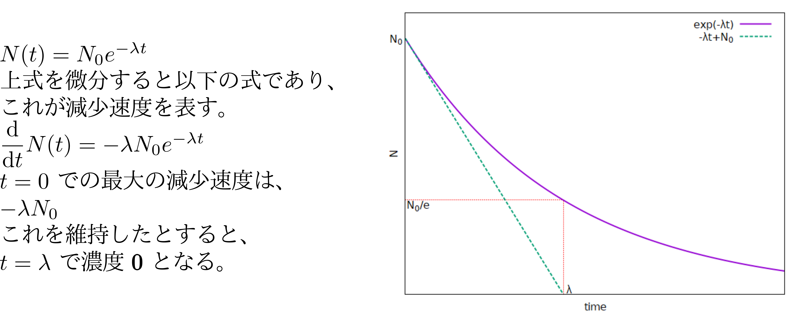

## 4. 物質のレオロジーを 始める前に、

1. ほんの少しの数学を思い出しましょう。
2. 物理モデルを理解するために必要なことを確認
3. 物理化学として単純な物質を見直しましょう
4. 少しだけややこしく

---

## 4-1. ほんの少しの数学

1. 関数とは
	* 線形の理解のために
	* 指数関数と対数関数を再確認
1. 微積分
	* 微分⇔瞬間的な振る舞いを記述するために
	* 積分⇔全体の量を把握するために
1. 簡単な微分方程式
	* 指数関数的な応答を理解するために

---

## 関数について

* 関数とは？
* 線形ということは？
* 指数関数と対数関数

--

### 関数とは

* 数式的な定義
	* ある変数に依存して決まる値
	* あるいは、その対応を表す式の事

--

### 関数とは

* 集合としての考え方
	* 数の集合に値をとる写像の一種

--

### 関数のイメージ

--

### 非常に単純な関数の例 （小中学校では）

* 時間と距離：旅人算⇔暗黙のうちに速度一定  
小学校では関数は使いませんが。

--

### 車の移動の例

* 単位時間当たりの移動量が変化
	* 単純な式では書けないが、
	* 時間の関数。
	* 微分については後程。

--

### 線形の応答について

* メリット
	* 重ね合わせが効き、取り扱いやすい。

--

### 線形以外の大事な関数

* 指数関数と対数関数
	* この2つの関数は逆関数であり線対称。

--

### 対数の大事なイメージ

* 対数は、桁数を表しているようなもの。
* ウェーバー・フェヒナーの法則で用いた

--

## このセクションのまとめ

* 関数とは
	* 変数を他の変数に対応させること。
	* 単純な数式で書ける場合「も」ある。
* 線型性
	* 例えば、一次関数
	* 重ね合わせができ、取り扱いが容易。
* レオロジーは指数関数と対数関数が頻出。
	* 桁数を考えるのにとっても便利。
	* 緩和を考えるのによく使う（後述）

---

## 微積分

--

### 微分  

* 変数の無限小増分に対する関数の増分
	* 接線の「傾き」
	* 変数が変わったとき関数がどうなるか？

--

### 自転車のライトは、微分と同じ

* 自転車のライトは、
	* 速度を上げると明るく、止まると消える。
	* 非常に短い時間あたりに進める距離
	* 明るさが瞬間的な速度を表す。

	

	
	

--

### 積分（定積分）

* 定積分とは、
	* 直感的には「面積」
	* 微小な刻みごとの面積を足し合わせる。

--

### 積分（逆微分）

* 微分の逆操作を意味する
	* 微分するとその関数に一致するような
	* 新たな関数（原始関数）を求める操作

--

### 微積分の直感的理解

* 微積分を使えば、
	* 微分で瞬間の描像を取り出し、
	* 積分で全体のふるまいを総量として把握。

--

## このセクションのまとめ

* 物理現象を表現するために、微分と積分をよく使う。
	* 微分で瞬間の描像を取り出し
	* 積分で全体のふるまいを総量として把握
	* 微分と積分は、逆操作⇔微分方程式を解くのに利用。
* 多数の公式があるが、ここでは省略。
	* 必要に応じて、少しずつ自習していってください。

---

## 簡単な微分方程式

--

### 1/x の積分

* 対数的、指数関数的な応答を理解するために、
* 一つだけ、積分の公式を

--

### 微分方程式の解き方

	

--

### ウェーバー・フェヒナーの法則の対数

* ウェーバー・フェヒナーの法則の対数は、
	* 以下のような感じで考えることができる。
	* 微分形式で書く意味がちょっと不正確？

--

### 指数関数的な応答

* 放射性元素の分解は一次反応の形で、
	* 減少する速さが減少する量に比例

--

### 指数関数的な減衰の意味

* 緩和時間
	* 指数関数的に減衰する場合、1/eとなる時間を緩和時間

--

## このセクションのまとめ

* 1/x の形の微分方程式を説明
	* レオロジーでは、この形のものは頻出。
	* いったんは、対数の形で解ける。
	* それを指数の形にして使用することが非常に多い。
	* これは、実は、緩和現象を表す。