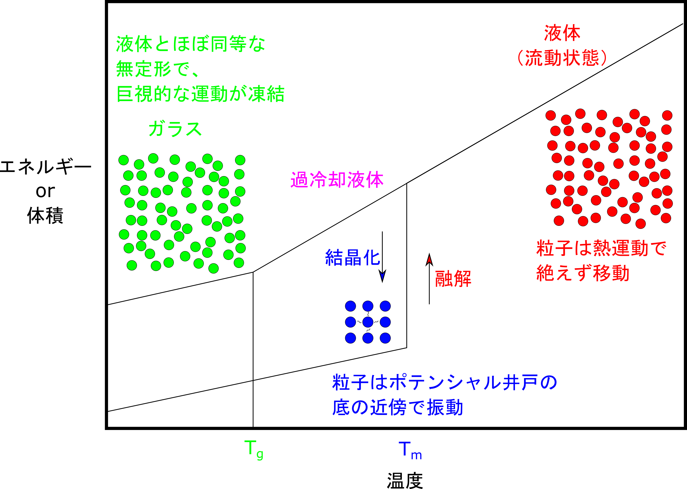

<!-- theme: gaia -->

<!-- page_number: true -->
<!-- paginate: true -->

## 4-3. 単純な物質について

検討の対象となる物質の性質について、 理科のレベルから大学の物理化学程度まで、 ゆっくりと再確認しましょう。

<!-- 

 -->

- 結晶と液体の違い
- 流れるということは？

---

## 結晶と液体の違い

---

### 物質の三態
aaa

---

### 固体の違いとは

- マクロな視点（手に取れるような大きさ）で考えると？
	- 気体、液体 ⇔ 流れる、周りの形状に変形
	- 固体 ⇔ 流れない、形を変えない
	- 一言で言えば、「流れるかどうか？」  
	（流れるということは、後ほど。）

- ミクロに中身を考えると何が違うのか？

---

### よくある個体の模式図

- 規則的に並んだ結晶構造（二次元模式図）

---

### 粒子の互いの関係について

- 二つの粒子間のポテンシャル（関係）：Lennard Jonesモデル
	- 速く消失する斥力ポテンシャル（第一項）
	- 遠くまで働く引力ポテンシャル（第二項）

	

---

### Lennard Jonesポテンシャルと力

- ポテンシャルを微分して力の形にすると以下のようになる。

	

---

### Lennard Jonesポテンシャルの意味

- 粒子間が近づきすぎると斥力
- 離れすぎると引力
- その結果として二粒子間の距離がほぼ定まる

---

### 固体のミクロな描像
aa

	

---

### LJ個体

- FCCに初期状態を作成⇔先程の図を三次元で。
- T = 0.1

---

## 固体と液体の間にある相転移

融解、結晶時に、比熱や体積に「飛び」が発生。

	

---

### 固体の溶融

- 先程のシミュレーションの体積変化

	

---

### LJ流体

- T = 1.0 （融点以上の温度）

---

### 粒子間の状態を観る方法

- 動径分布関数：
	- ある粒子から距離の関数として他粒子の数を数える。
	- すべての粒子で同じことをやる。

---

### LJ個体

- FCCに初期状態を作成
- T = 0.1（融点よりも低温で運動が抑制）

---

### LJ固体の動径分布関数

- 離れた遠くの距離でも並んでいる
- r>4の遠くまでピークが見える。

---

### LJ流体

- T = 1.0 （融点以上の温度）

---

### 溶融後のLJ流体の動径分布関数

- T = 1.0 （融点よりも高温で運動が活発）
- 少し離れたらピークがなくなる。

---

### 過冷却とガラス転移

実際は単純ではなくて、 過冷却やガラス化が生じる。（後述）

---

### 動径分布関数による三態の違い

- 固体は規則的に並んで、鋭いピーク
- 液体は波打っている。
- 気体は、少し離れると密度が一定

---

### 温度をベースに考えた物質の三態

- 三態とは、
	- 高温では、自由に動ける気体
	- 中温では、適度に移動できる液体
	- 低温では、最も落ち着きのいい固体  

ポテンシャル井戸の底が一番居心地がいい

だけど、

外場（熱エネルギー）の影響で動かされる。

---

### 物質の三態の示すもの

- 三態とは、以下の二つの効果のせめぎあい
	- 粒子は熱エネルギーで移動させられる。
		- この熱エネルギーの実感が難しいが、ここは天下り。
	- 任意の位置に落ち着きたい。  
		- 粒子間相互作用
		- その結果として、内部構造を形成。
	- 結晶化を抑制するためには、規則的な相互作用を抑制すればよい。

---

## このセクションのまとめ

- 物質の内部をミクロにみると、
	- 固体は規則的に並んで、鋭いピーク
	- 液体の内部には不均一な濃度揺らぎ
	- 気体は離れていて、密度が一定
- 固体においても、相互作用によっては粒子の並び方は単純ではない
- 温度に応じて、粒子間の相対的な並び方の乱れ方が変わる。

---

## 流れるということは？

---

### 流れるということは？

- 液体に外力を加えない時（コップの中の水）
	- マクロには、
		- 変化しない：止まって見える
	- ミクロには、
		- 熱エネルギーで粒子がランダムに運動
		- 粒子の近くに隙間ができると移動
		- その移動により、別の隙間ができて他の粒子がそこに移動。
	- 上記の相互の入れ替えは常に発生。

---

### LJ流体

- T = 1.0 （融点以上の温度）

---

### 移動のための隙間とは

- 液体の相互の位置は、規則的ではない。
	- 粒子径(r/σ=1)より少し離れた所にピーク。
	- それより少し遠くに、密度の低い領域が。

---

### 液体の流動のミクロな描像

- 乱雑に並んだ粒子がそれぞれ運動。
- 一粒子に着目すると、少しずつ元の位置から移動

---

### 液体の流動のミクロな描像

---

### LJ流体（一粒子に着目）

- T = 1.0 （融点以上の温度）

注意：ブラウン運動というわけではない。

---

### 流れるということは？

- 外力を加えない場合、
	- ミクロには、「密度の揺らぎによる隙間」を経由した相互の入れ替えは常に発生。
- 外部から力がかかると、
	- 力のかかった方向への移動のほうが優先
	- 逆への移動が、なくなるわけではない
	- 結果として、マクロに全体が移動。

（余談）この「密度の揺らぎによる隙間」が、 よく言われる「自由体積」

---

## このセクションのまとめ

- 液体は粒子の運動が少しだけ激しくて、
	- 固体より、密度が低下
	- 密度揺らぎの隙間が多い。
- 流れるということは、
	- 外部からの力の方向への移動が優先
	- 結果として、マクロに全体が移動。
- 外部の型に従って変形して隙間を埋める。

