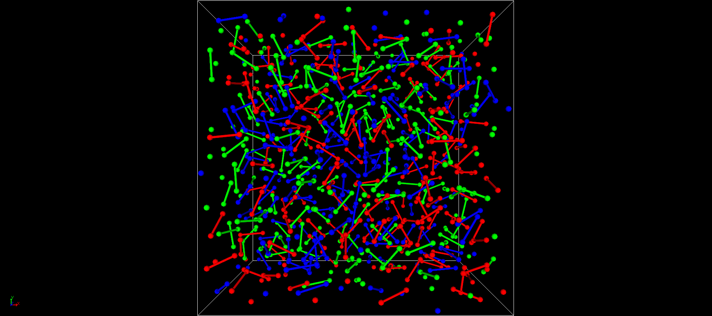

## 4-4. 少しだけややこしく

* 固体と液体の境目
* ガラス状態とは
* 結晶性の固体についても考え直す

---

## 固体と液体の境目

--

### 少しややこしい例：水の個体⇔氷

* 氷状態では規則的に並ぶが、ミクロに見ると案外運動している

http://www.cc.kochi-u.ac.jp/~akamatsu/H2O/

--

### 水と氷の共存（293K）

* 液体（右側）では、構造が崩れてランダムに移動
* 構造中の隙間のため、水は固形化で膨張

http://www.cc.kochi-u.ac.jp/~akamatsu/H2O/

--

### 速く変形させようとすると固体的に

* 流動するとは、
	* 隙間に粒子が移動
	* 空いた場所に他の粒子が移動
* 分子が動くより早く変形しようとすると？
	* 速い速度で水を変形（高所から飛び込み）
	* 液体が固体的な挙動

--

### 時間をかけると固体も液体的に

* 長時間では、氷河も流れる

https://ja.wikipedia.org/wiki/%E6%B0%B7%E6%B2%B3

  

--

### ピッチドロップ

* ピッチとは道路の舗装に使うコールタール
* アイルランドのトリニティ・カレッジ
* ピッチが落下する瞬間

<iframe width="560" height="315" src="https://www.youtube.com/embed/k7jXjn7mIao" frameborder="0" allow="accelerometer; autoplay; encrypted-media; gyroscope; picture-in-picture" allowfullscreen></iframe>

--

### このセクションのまとめ

固体と液体の境目は？

* 現象論的な理解
	* 熱エネルギーの大小で変化
	* 変形速度（時間の進み方）でも変わる。
* ポイント
	* 境目は曖昧
	* 時間と温度の関係が大事⇔粘弾性
	* 内部構造の有無が大事

--

#### 猫は液体か？（おまけ）

---

## ガラス状態とは

--

### 過冷却とガラス転移

--

### 冷却温度と並びやすさ

https://hr-inoue.net/zscience/topics/glass/glass.html

--

### ポリマーのガラス化

* ガラス状態とは、急冷により液体状態が固定されたもの。
* マクロに見れば固体。
* ミクロな部分としては、少しだけ移動できる場合がある。
* ポリマーの多くは、非晶性でガラス化。
	* 多数の粒子がつながるため結晶化が抑制。
	* 一つの粒子が並ぼうとしても横にもう一つ
	* 急冷しなくても、容易にガラス化

--

### LJポリマーのガラス転移

* FENE-LJで連結したLJ粒子でポリマーを表現
	* N=2
* 2つの粒子がつながっただけでガラス化。

--

### 液体状態(N=2, T=1)

* ガラス転移温度以上での激しい運動

--

### ガラス状態(N=2, T=0.1)

* ガラス転移温度以下での運動の凍結
* しかしながら、結晶のような構造はない。
* 止まっていると、液体と見分けがつかない。

--

## このセクションのまとめ

* ポリマーの多くは、非晶性でガラス化。
	* ポリマーは粒子が連結しているため、 結晶化が抑制
	* 急冷しなくても、容易にガラス化
* ガラス転移温度を境に運動性が大きく変化
* 動きやすい部分があれば、ガラス転移温度は低下

---

## 結晶性の固体でも

--

### 金属とイオン性結晶の違い

* イオン結合等はミクロなズレができない
* 金属結晶は、一般にずり変形も可能

https://www.hik.shiga-irc.go.jp/info/instructions/metal/metal2/

--

### 金属結晶の欠損

https://www.hik.shiga-irc.go.jp/info/instructions/metal/metal2/

--

## このセクションのまとめ

* 結晶であってもずり変形は可能
	* 欠損の有無が重要
	* 金属の場合は、転移が生じやすい
* 結晶でも流れないわけではない。
	* 巨視的な変形も生じる←軟鉄
* 一般に変形しにくいものは脆い
	* 欠損をなくせばよいというものでもない