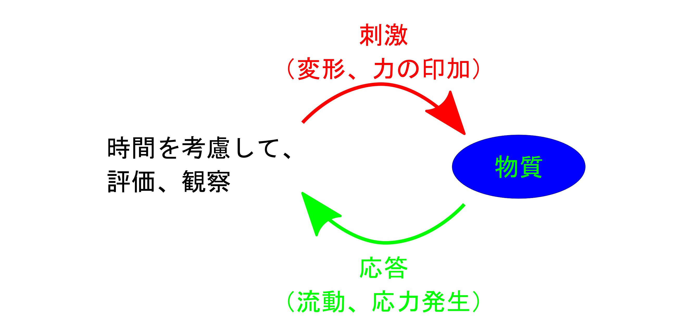

## 5. レオロジーのはじめの一歩

* レオロジーの刺激と応答
* 物質の歪みと応力
* 応力の起源
* 基本的なモデル

---

## レオロジーの刺激と応答

--

### レオロジーの基本的なやり方

* 「物質」に「刺激」を与えて「応答」を評価
* 時間や温度の因子も重要となる。

---

## 物質の歪みと応力

* 変形の単純化
	* 引張変形
	* ずり変形
* 変形により、
	* 物質は歪む
	* 内部で応力が発生
--

### 物質の変形と歪み

* 引張変形
	* 物質を一軸方向に引っ張ることで変形する

--

### 物質の変形と歪み

* ずり変形
	* 物質を横にずらすように変形する
	* このとき、物質の体積は変化しない。

--

### 力と応力

* 物質に外力を印加して引き延ばした場合、
	* 応力は、物質の内部で面を通してお互いに働きあう力。

--

### ずり応力

* ずり変形の場合は、力は偶力となる。
	* 内部で面を通したずり（せん断）応力が発生

--

### 液体の変形

* 液体は流れる
	* ずり変形を与えると流れ続ける。
	* 変形を止めれば応力も消失
	* 応答を見るのが困難
* 変形を続けて、応力を見る。
	* 液体内部での変形を考える必要

--

### せん断速度のイメージ

* 上部の面積 S の部分に、力 F を印加。

--

### せん断速度のもう一つの考え方

* 液体上を物体が移動し、せん断応力が発生。

--

### このセクションのまとめ

* 変形を単純化すると、
	* 引張変形とずり変形
* 変形により、
	* 物質は歪んで、内部で応力が発生
	* 単純な固体は応力が一様（本当は違う）
* 液体の変形
	* 変形を止めれば応力も消失するため応答を見るのが困難
	* 変形を続けて、応力を見る。
	* 液体内部での変形を考える必要
---

### 応力の起源

* ここでの変形は、
	* 線形応答となるような微小な変形
	* その時の系の応答である応力は、
	* 重ね合わせの適応できる理想的なもの
* 応力の起源を考えよう。

--

### 固体の変形

* マクロな微少変形に対しては、
	* ポテンシャルの井戸を昇る線形応答。

	

--

### 固体の変形に対する応答のモデル

* このような変形に対する線形応答は、
	* バネのモデルで考えることができる。
	* 「フックの法則」

	

--

### マクロな流動の模式図

* トランプのカードのようなイメージ

    

* 作用点から離れると、せん断速度は低下

    

--

### 移動のための隙間とは

* 液体の相互の位置は、規則的ではない。
	* 粒子径(r/σ=1)より少し離れた所にピーク。
	* それより少し遠くに、密度の低い領域が。

--

### 液体のミクロな描像

* 外部からの変形がなければ、マクロには同じ場所にとどまる。
* ミクロには、すごく動いている。

--

### ミクロな流動の描像

--

### ミクロな摩擦の由来

* 応力のかかった居心地の悪い状態から、
* かごを抜け出して楽な状態へと少しずつ変化

--

### 層別に分けたメゾスケール

    

--

### ニュートン流動の描像

--

### 液体の変形

* 液体はそれぞれの粒子の近傍に不均一な隙間
	* マクロな変形は、相似的には働かない。
	* 真面目に考えると取り扱いが面倒。
* いったんは、天下りに「ニュートンの法則」
	* 液体の発生する応力はひずみ速度に比例
	* その比例定数が粘度

--

### このセクションのまとめ

* 固体の応力は、力の釣り合いで評価できる
	* ミクロにポテンシャルの井戸でモデル化
	* バネモデルでの線形応答が妥当
* 液体の応力は、流れている状態で発生
	* ニュートン流動に単純化したマクロでは、
		* 一定の速度勾配で変形
	* ミクロには、
		* 粒子が隣の空孔に少しずつ移動
	* メゾに考えると、
		* 各層ごとの面を通して応力が発現

---

## 基本的なモデル

弾性と粘性

--

### 「フックの法則」

* バネモデルで考えた力を応力の形にして、応力は歪に比例。

	

--

### 「ニュートンの法則」

	

* ずり変形を止めれば、応力も消滅。
* 各層ごとの応力伝搬が移動速度に比例と仮定すると、ニュートンの法則が成立

--

### 「ニュートンの法則」

	

--

### ミクロな流動の描像

逆に言えば、粒子間に働く力が不均一であれば、ずり応力は面の移動速度に比例しなくなる。

--

### このセクションのまとめ

弾性と粘性の基本的（単純化した）なモデル。

* 弾性モデル
	* フックの法則  
	応力は与えた歪に比例し、比例定数が弾性率。
* 粘性モデル
	* ニュートンの法則  
	ずりにより生じる応力がずり速度に比例し、比例定数が粘度。