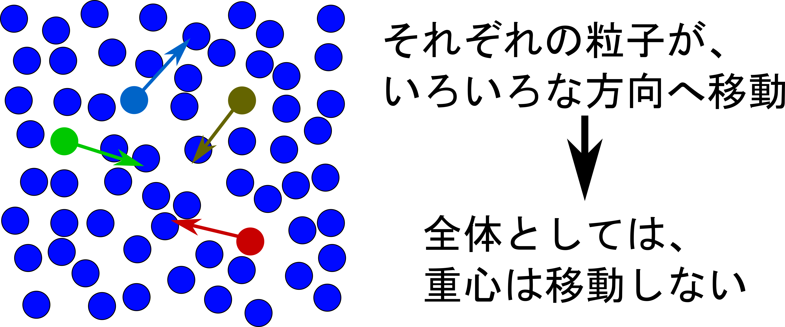
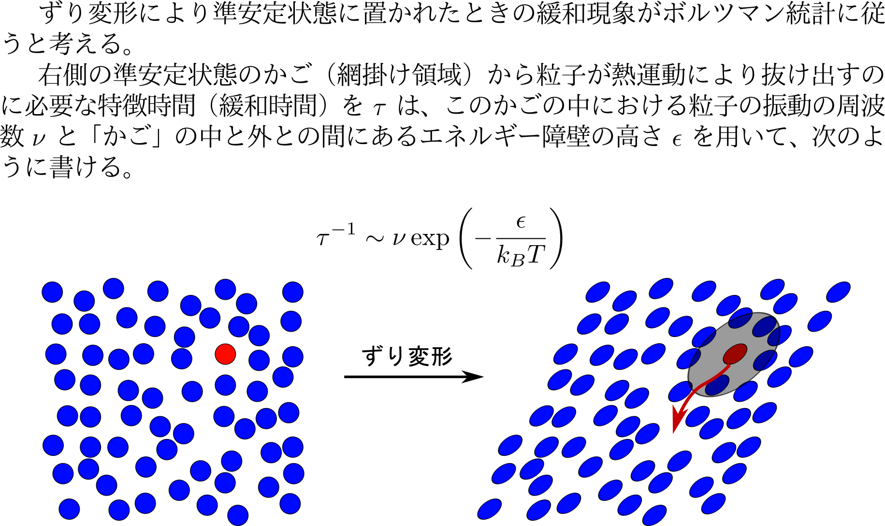
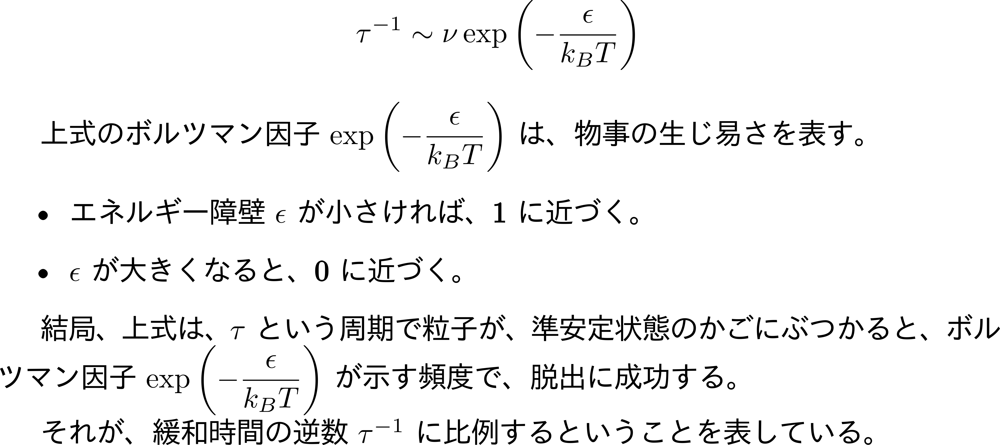
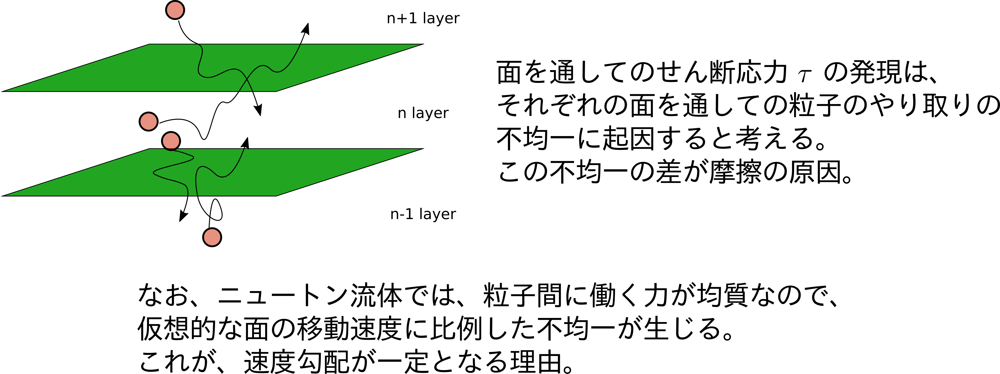

## 6. 複雑な事象について

* 流れるということをもう少し詳しく
* 非ニュートン流体

---

## 流れるということを もう少し詳しく

--

### 移動のための隙間とは

* 液体の相互の位置は、規則的ではない。
	* 粒子径(r/σ=1)より少し離れた所にピーク。
	* それより少し遠くに、密度の低い領域が。

--

### 液体のミクロな描像

* 外部からの変形がなければ、マクロには同じ場所にとどまる。
* ミクロには、すごく動いている。

--

### ミクロな流動の描像

--

### ミクロな摩擦の由来

* 応力のかかった居心地の悪い状態から、
* かごを抜け出して楽な状態へと少しずつ変化

--

### 流れるということは？

* 外力を加えない場合、
	* ミクロには、「密度の揺らぎによる隙間」を経由した相互の入れ替えは常に発生。
* 外部から力がかかると、
	* 力のかかった方向への移動のほうが優先
	* （注意）逆向きへの移動がなくなるというわけではない。
	* 結果として、マクロに全体が移動。

--

### 粒子の移動のモデル

* 粒子が移動するために、活性化ポテンシャルを超えるモデル

--

### 粒子の移動のモデル

--

### 粒子の移動のモデル

--

### 粒子の移動のモデル

--

### 粒子の移動のモデル

--

### 層別に分けたメゾスケール

    

--

### 流動の描像

* 逆に言えば、面を通したせん断応力が一定でなければ、非線形

--

### 少しだけ大粒子が入った場合

* 大粒子が少しだけ入った場合の全体の粘度
	* その体積分率に応じて粘度が上昇。
	* 大粒子の回転等の運動から算出。
	* この式は、粒子が相互作用がない場合。
* 濃度が高くなると高次の項が出てくる。

--

### このセクションのまとめ

* ニュートン流体においても、
    * 流動は単純ではない。
* 液体の流動はエネルギーの散逸を伴う。

---

## 非ニュートン流体

--

### 身近な液体の粘度

    

--

### ビンガム氏による 「変形と応答の分類」

    

--

### 流れ方

* せん断速度（変形速度）と発生する（必要な）応力の関係をプロット
* 単純な液体は比例（ニュートン流体）
* 比例関係でないものは、非ニュートン流体

    

--

### 固体的な流動

* ビンガム流体
	* 降伏応力まで流れない
* ダイラタント流体
	* 速い変形で固体的

    

--

### 粒子間の相互作用

* ビンガム流体
	* 粒子間の相互作用が一定応力で消失
* チクソトロピック流体
	* ずり速度の上昇により、相互作用が部分的に消失

    

--

### ダイラタント流体

<iframe width="560" height="315" src="https://www.youtube.com/embed/ycgMwNlnvR4?start=2&end=35" frameborder="0" allow="accelerometer; autoplay; encrypted-media; gyroscope; picture-in-picture" allowfullscreen></iframe>

https://www.youtube.com/embed/ycgMwNlnvR4?start=2&end=35

--

### ダイラタント流体のメカニズム

    

--

### ダイラタント流体のメカニズム

    

http://trizmegane.cocolog-nifty.com/zukai/2011/06/007-0d30.html

--

### スイーツの強さ

<iframe width="560" height="315" src="https://www.youtube.com/embed/hC6v2MqQjqg" frameborder="0" allow="accelerometer; autoplay; encrypted-media; gyroscope; picture-in-picture" allowfullscreen></iframe>

https://www.youtube.com/embed/hC6v2MqQjqg

--

### とっても強い塗料

<iframe width="560" height="315" src="https://www.youtube.com/embed/x2pJNOpr-SY?start=30&end=110" frameborder="0" allow="accelerometer; autoplay; encrypted-media; gyroscope; picture-in-picture" allowfullscreen></iframe>

https://www.youtube.com/embed/x2pJNOpr-SY?start=30&end=110
--

### 変形速度の違い（おまけ）

* 速い変形にたいしては、
	* 内部の変形が追い付かないので個体的に弾性
* 遅い変形では、
	* 内部も変形できるので、粘性的に流動

<iframe width="560" height="315" src="https://www.youtube.com/embed/u-JouUxZuGI" frameborder="0" allow="accelerometer; autoplay; encrypted-media; gyroscope; picture-in-picture" allowfullscreen></iframe>
