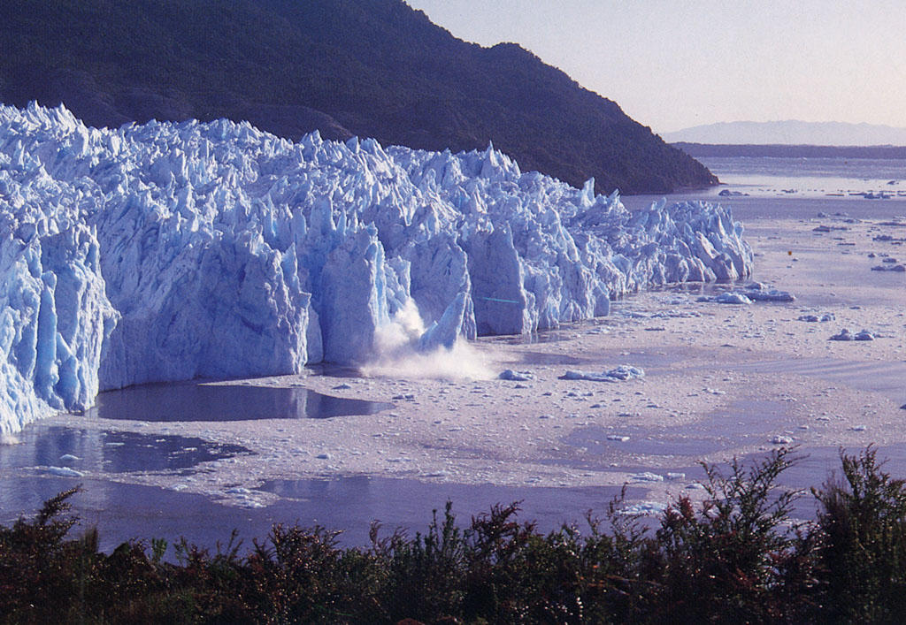
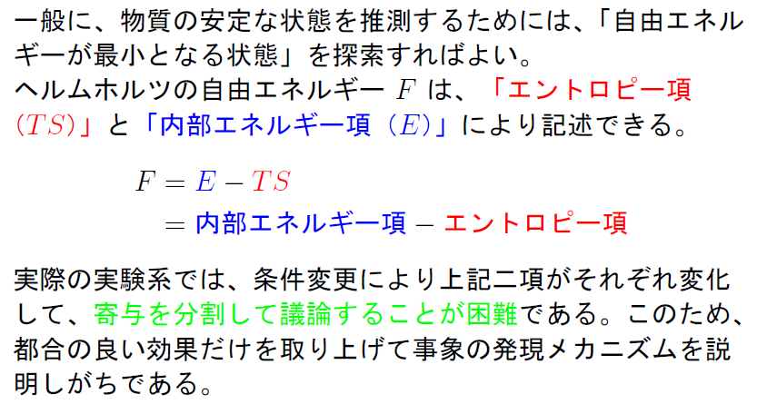
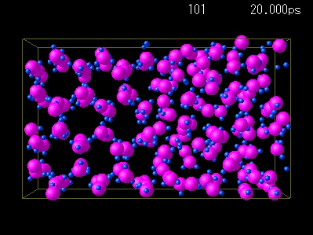
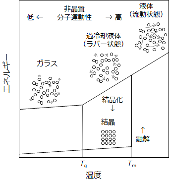

## 7. 時間と温度が変わると？

* 時間が変わると
* 温度が変わっても
* 固体と液体の境目は？

---

## 時間が変わると

--

### 速く変形させようとすると固体的に

* 流動するとは、
	* 隙間に粒子が移動
	* 空いた場所に他の粒子が移動
	* 移動するために時間τが必要
* 分子が動く時間より早く変形しようとすると？
	* 速い速度で水を変形（高所から飛び込み）
	* 水分子が移動する時間が足りない
	* 液体が固体的な挙動

--

### 時間をかけると固体も液体的に

* 長時間では、氷河も流れる
	* 固体に見える氷も分子が少しずつ入れ替わる

  

--

### ピッチドロップ

* アイルランドのトリニティ・カレッジ
	* ピッチとは道路の舗装に使うコールタール
	* ピッチが落下する瞬間を長期にわたって観察

<iframe width="560" height="315" src="https://www.youtube.com/embed/k7jXjn7mIao" frameborder="0" allow="accelerometer; autoplay; encrypted-media; gyroscope; picture-in-picture" allowfullscreen></iframe>

https://www.youtube.com/embed/k7jXjn7mIao

---

## 温度が変わっても

--

### 温度を高くすると、

* 温度が高くなると、
	* 粒子の運動が激しくなる。
	* 隣の隙間への移動が容易になる。
	* アンドレードの式の分母が大きくなる。
	
--

### 温度をかけても当然流れる

ガラスの流動の例として、吹きガラス

<iframe width="560" height="315" src="https://www.youtube.com/embed/a9j_Z3yK2SE?start=13&end=44" frameborder="0" allow="accelerometer; autoplay; encrypted-media; gyroscope; picture-in-picture" allowfullscreen></iframe>

https://www.youtube.com/embed/a9j_Z3yK2SE?start=13&end=44

---

## 固体と液体の境目は？

--

### 固体と液体の境目は？

* 現象論的な理解
	* 熱エネルギーの大小で変化
	* 変形速度（時間の進み方）でも変わる。
* ポイント
	* 境目は曖昧
	* 時間と温度の関係が大事⇔粘弾性
	* 内部構造の有無が大事

--

### 自由エネルギー

* 相転移の判断基準:
	* 熱力学（統計力学）を各自再学習 

--

### 相転移として氷と水を見直す

* 水と氷の共存（293K）⇔氷を溶かす
	* 液体のほうがエントロピーが大：好ましい
	* 液体状態で動かすためにエネルギーが必要
	* 相転移での融解熱

--

### 結晶化とガラス転移

* 結晶化：粒子同士が規則的に並ぶ
* ガラス化：液体と類似の状態で動けなくなる。  
二次の相転移⇔転移熱は発生しない

--

## このセクションのまとめ

* 液体と固体の境目は、はなはだ曖昧。
	* 特に固体が結晶ではないとき。
	* ガラス状態を液体と見分けるのは難しい。
* （これから議論する）高分子では、
	* 部分的に液体なので、両面性を有する。
	* 粘弾性が重要。

