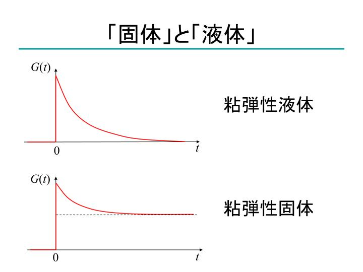

## 8. 粘弾性について

* 粘弾性の基本的なモデル
* 緩和時間
* 粘弾性測定
---

## 基本的なモデル

粘弾性

--

## 粘弾性のモデル

	

--

### マックスウェルモデル

* 二つのモデルを合わせて粘弾性を評価

	

---

## 緩和時間

--

### マックスウェルモデルの方程式と 緩和時間

	

--

### 緩和時間は一次反応と同じ形式

* 緩和時間進むと、応力は 1/e

--

### 緩和時間の直感的理解

* 緩和時間と観測時間
	* 緩和時間よりも短い時間で観測すると、固体的なふるまい
	* 緩和時間よりも長い観測では、系は流動。
* 緩和時間は以下のように粘度と弾性率の比であるから、相対的に粘度が高くなると長時間化。
	* 粘度の高い現象の流動は長時間。

	

---

## 粘弾性測定

--

### 応力緩和

* 任意の時刻に変形を加えて、その応力が消滅する過程を観察

	

--

### 応力緩和

	

--

### 固体と液体の区別

	

--

### 一般化マックスウェルモデル

* 緩和時間の異なる複数のマックスウェルモデルを組み合わせると、
	* 複雑な緩和現象もモデル化できる。

	

--

### 動的粘弾性

* 周期的な変動を印加して、応答を測定

	

--

### 貯蔵弾性率と損失弾性率

--

### 動的粘弾性では

* 動的粘弾性  
サンプルに周期的な変形を与えて測定
	* 温度分散  
	周期を一定にして温度を変化した測定
	* 周波数分散  
	温度を一定にして、周波数をスイープ
* 位相の遅れを評価することで、粘性項を見積もり可能  

--

## 大事なポイント

* 線形応答の範囲では、
	* 応力緩和測定と動的粘弾性測定は等価
	* 数学的に導出できる。
	* フーリエ変換で相互に変換可能
* 正確な応力緩和測定は
	* 時間がかかって面倒
	* 測定が困難
* 便利な動的粘弾性測定をやりがち。