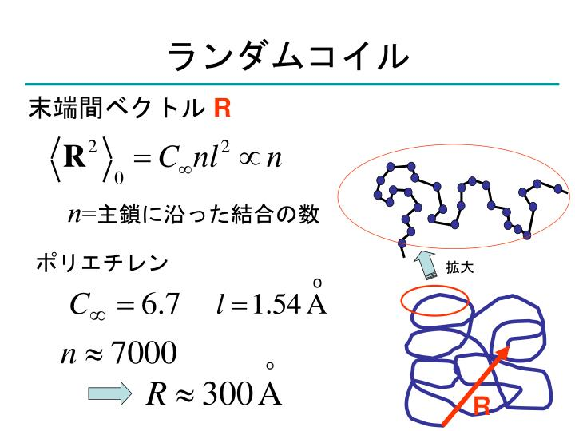
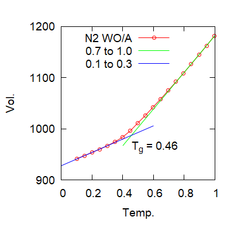

## 9. 高分子について

* 高分子とは
* 高分子の性質
* 高分子のガラス転移

---

## 高分子とは

* モノマーが重合により繋がって長い高分子
* 高分子の特徴的振る舞い
    * 「細くて」、「長くて」、「丸まった」  
    * グニャグニャ蠢くひものようなもの
--

### 高分子の作り方  

* モノマーが重合により繋がって長い高分子
* 初期は、大量のモノマーの中を蠢き、
* 後期は、互いに束縛しあって動きにくくなる。

（動画あり）

---

## 高分子の性質

* 「細くて」、「長くて」、「丸まった」  
* グニャグニャ蠢くひものようなもの

--

### 高分子は、細くて長い

--

### 高分子は、柔らかい

--

### 高分子は、くるくる丸まっている

--

### 高分子は、入り組んでいる

--

### ポリマー鎖の動きを見る

（ポリマーのイメージ動画）
--

### ポリマー鎖の動きを詳しく

ポリマー鎖が一本ずつ見えるように

---

## 高分子のガラス転移

* ガラス化：液体と類似の状態で固体化。
* 繋がったひもとして、動けなくなる状態

    

--

### ポリマーのガラス化

* ガラス状態とは、急冷により液体状態が固定されたもの。
* マクロに見れば固体。
* ミクロな部分としては、少しだけ移動できる場合がある。
* ポリマーの多くは、非晶性でガラス化。
	* 多数の粒子がつながるため結晶化が抑制。
	* 一つの粒子が並ぼうとしても横にもう一つ
	* 急冷しなくても、容易にガラス化

--

### LJポリマーのガラス転移

* FENE-LJで連結したLJ粒子でポリマーを表現
	* N=2
* 2つの粒子がつながっただけでガラス化。

--

### 液体状態(N=2, T=1)

* ガラス転移温度以上での激しい運動

--

### ガラス状態(N=2, T=0.1)

* ガラス転移温度以下での運動の凍結
* しかしながら、結晶のような構造はない。
* 止まっていると、液体と見分けがつかない。

--

## このセクションのまとめ

* ポリマーの多くは、非晶性でガラス化。
	* ポリマーは粒子が連結しているため、 結晶化が抑制
	* 急冷しなくても、容易にガラス化
* ガラス転移温度を境に運動性が大きく変化
* 動きやすい部分があれば、ガラス転移温度は低下
* LJ粒子のシミュレーション
	* 主鎖の剛直性が上がればTg上昇。
	* 側鎖の効果もシミュレートできた。

--

### このセクションのまとめ

* モノマーが重合により繋がって長い高分子
* 高分子の特徴的振る舞い
	* 「細くて」、「長くて」、「丸まった」  
	* グニャグニャ蠢くひものようなもの
	* きれいに並べるのはとっても困難
* ガラス化しやすい
	* 結晶性高分子もあるが、部分的に結晶化
* 非常に特徴的な粘弾性特性を示す。

